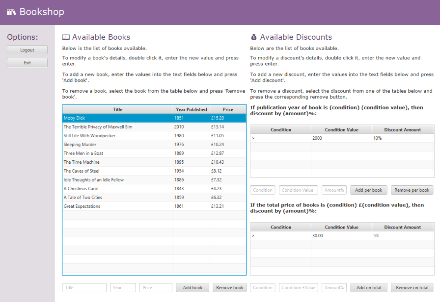

# bookshop

Bookshop implementation using JDK 14.0.1 and JavaFX 14.0.2.1.

Calculates total purchase cost of selected books after applying any discounts.
Allows for management of books and discounts (UI for this is shown below).

### How To Run:
1. I used IntelliJ IDEA.

    If using IntelliJ IDEA to run, the following may be useful:

    1. https://www.jetbrains.com/help/idea/javafx.html#add-javafx-lib
    2. https://www.jetbrains.com/help/idea/javafx.html#vm-options

    If you cannot compile my program regardless, you can still run my executable jar found in /out/artifacts/bookshop_jar.

2. The username and password required to access the manage (add/remove/update) books and discounts page as the authorised bookkeeper was chosen for simplicity (and not security) and are:

    Username: Admin

    Password: Password
